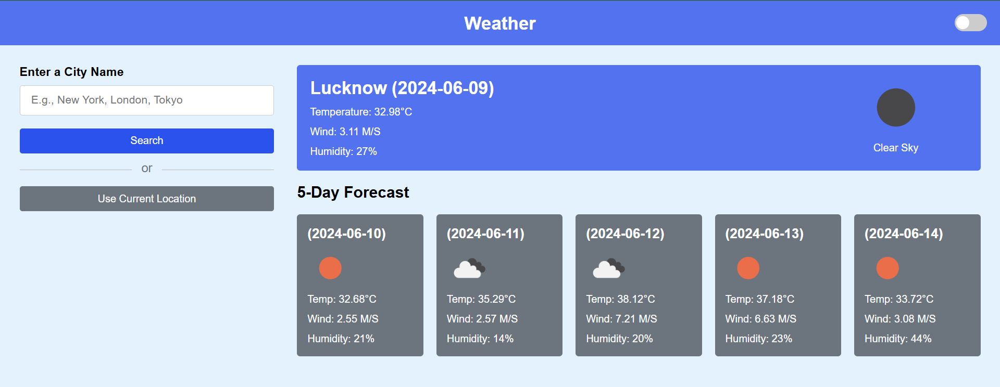
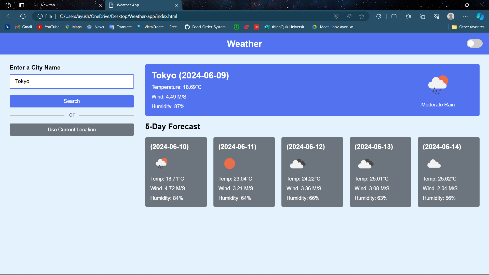
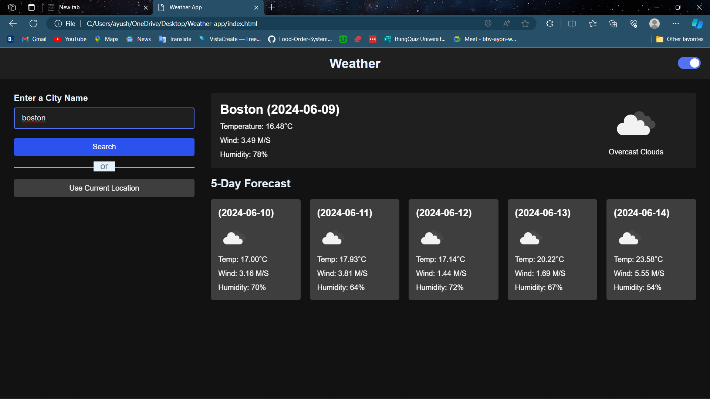

# Weather App

This Weather App allows users to get the current weather, hourly forecast, and 5-day forecast for any city. Users can also toggle between light and dark modes and use their current location to get weather data.

## Features

- Search weather by city name
- Display current weather, hourly forecast, and 5-day forecast
- Use current location to fetch weather data
- Toggle between light and dark modes

## Technologies Used

- HTML
- CSS
- JavaScript
- OpenWeatherMap API

## Instructions

### Prerequisites

- A web browser (e.g., Chrome, Firefox, Safari)
- An API key from OpenWeatherMap (sign up at https://openweathermap.org/api)

### Running the Application Locally

1. **Clone the repository** (or download the files):

   ```bash
   git clone https://github.com/willeynimbus/weather-app.git
   ```

2. **Navigate to the project directory**:

   ```bash
   cd weather-app
   ```

3. **Open `index.html` in your web browser**:

   You can do this by simply dragging and dropping the `weather-app` folder into an open browser window and click on `index.html`, or by right-clicking the file and selecting "Open with" your preferred browser.

### Usage

- **Search by City Name**: Enter a city name (e.g., "New York") and click "Search" to get the weather data.
- **Use Current Location**: Click the "Use Current Location" button to fetch weather data based on your current geographic location.
- **Toggle Dark Mode**: Use the toggle switch in the top-right corner to switch between light and dark modes.

## Known Issues and Limitations

- **API Rate Limits**: The application uses the free tier of the OpenWeatherMap API, which has a limited number of requests per minute. You might encounter rate limiting if you make too many requests in a short period.
- **Geolocation Permissions**: The app requires geolocation permissions to use the current location feature. Users need to allow the browser to access their location.
- **Cross-Browser Compatibility**: The app has been tested in modern browsers (Chrome, Firefox, Safari). There may be some styling issues in older browsers or Internet Explorer.

## File Structure

- `index.html`: The main HTML file that contains the structure of the web page.
- `style.css`: The CSS file that contains styles for the application.
- `script.js`: The JavaScript file that contains the functionality of the application.

## Acknowledgements

- [OpenWeatherMap](https://openweathermap.org/) for providing the weather data API.

## Screenshots

- Weather-app preview

- 
- 

- Dark Mode Preview
- 
